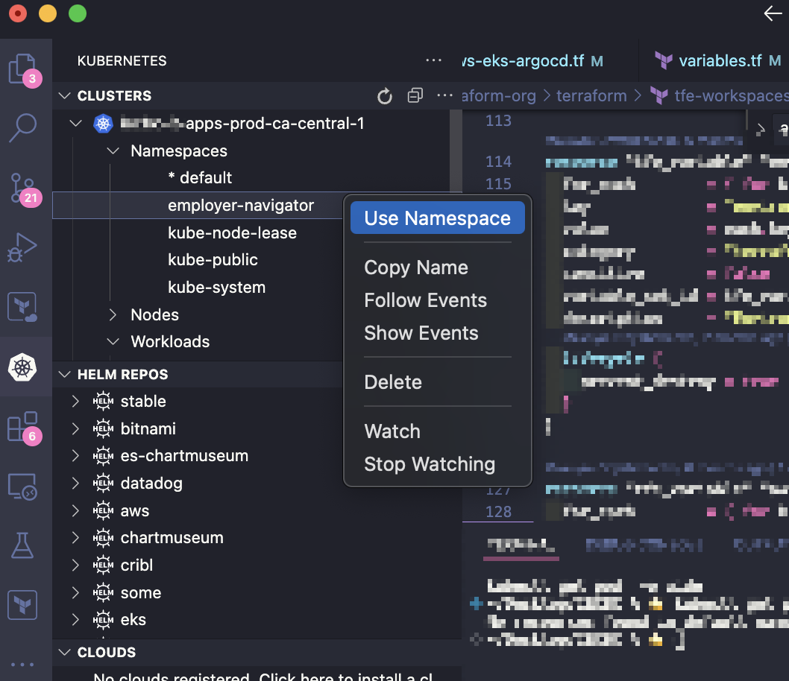
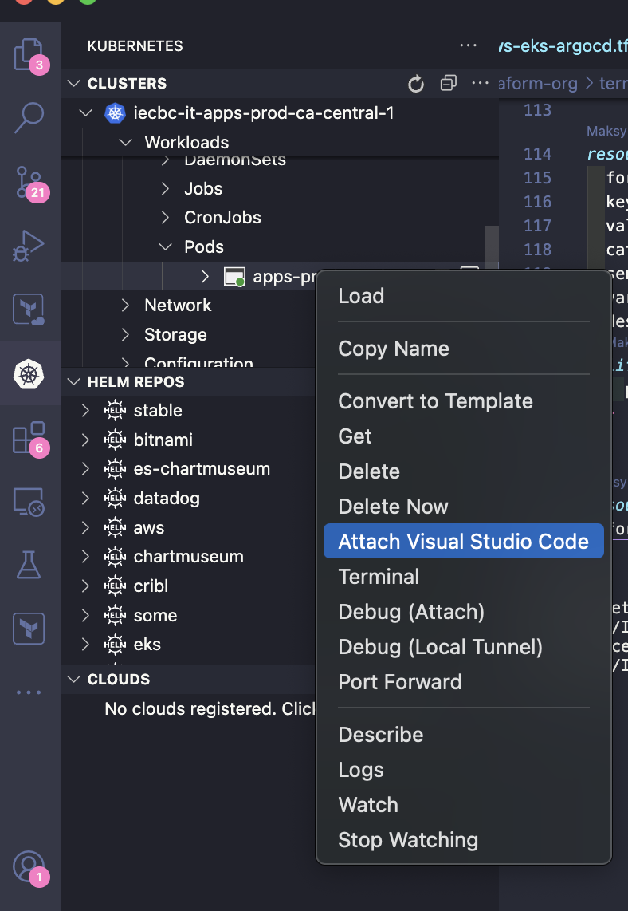

# DevMode Tool Documentation

DevMode is a command-line interface (CLI) tool implemented in Python that facilitates development process in Kubernetes environments.

DevMode enables development directly in a `dev` EKS environment, providing greater parity with production compared to local solutions like docker-compose or Minikube.

It provides **more control**, **less errors**, **faster iterations**.

## Installation Instructions

### Install Dependencies

`pip3 install -r requirements.txt` (globally)

### Add to PATH

On macOS, you can add the script to your PATH by:

Add this tool to your PATH for easy access:

```bash
mkdir -p ~/scripts
ln -s "$(pwd)/devmode.py" ~/scripts/devmode
echo "export PATH=$PATH:~/scripts" >> ~/.zshrc
```

## Usage
DevMode tool requires an existing deployemnt to be cloned.  
`devmode --help`

- Authenticate to AWS
- Make sure you are using the correct KUBECONFIG and context

Start the workspace:  
`devmode start --deployment_name <deployment>  --namespace <namespace> --workspace_name name-surname`

Note: Git credentials are handled automatically by VSCode's built-in credential management. You do not need to manually configure credentials inside the container:  
For the first time, clone any repo from your private VCS with API token (not SSH) - that will store your credentials in `credentials-helper` store.
Git crentials are propagated automatically by VScode magic. (It sets `GIT_ASKPASS` environment variable).

### Connect VSCode

- Install extensions `ms-kubernetes-tools.vscode-kubernetes-tools` and `ms-vscode-remote.remote-containers` (it was reported that "Attach Visual Studio Code" option was missing without this extension)
  Connect to the container newly created container with [VScode](https://code.visualstudio.com/docs/devcontainers/attach-container#_attach-to-a-container-in-a-kubernetes-cluster)  
  Open the `workspace_path` in VScode.  
  Open terminal in VScode and clone your repo:
  `git clone <your_repo_url> .`

🎊

 


## Development Instructions

- Install git hooks. Run this command `git config core.hooksPath .githooks`.

Run with `LOG_LEVEL=debug devmode list` to see debug logs.

use `.vscode/launch.json`
`devmode -- --interactive`
`devmode -- --trace	`

### Contribution

<!-- - Configure Jenkinsfile and Github Action  -->

- Refactor, create `Workspace` class.
- Show informative error when aws logged out.
- Change selector to avoid interering with existing service. Find service, ingress and create clones with `-devmode` prefix.
- Enable creating a pod's clone. Now you can clone only Deployment.
- Enable non gp2 StorageClass (or use default).
- Enable Specifying a custom image.
- "Don't elevate privileges" flag
- **Super contribution** - launch th.e image built from Dockerfile.

### Testing

It uses `pytest` and a custom fixture which creates a temporary namespace.  
EKS cluster must be connected.

# Why DevMode

More control

Better to say - allows to focus on things you should really control instead of wasting effort on EKS environment simulation.

#### Less errros

Compared to docker-compose, developing directly within Kubernetes provides a narrower scope of potential errors. Achieving parity when developing locally requires simulating a Pod environment, which introduces additional complexity. Below is a comprehensive list of pitfalls that arise during local development:

- docker-compose
  - YAML syntax errors
  - Docker VM configuration discrepancies
  - Lack of parity with Kubernetes networking and service discovery
- AWS IAM Access
  - The mechanism for passing credentials differs, occasionally causing errors.
  - The developer's IAM role is often more powerful than the Pod's IAM role, leading to authorization errors during production.
- Kubernetes Control Plane
  - If the application interacts with the Kubernetes control plane, it relies on your local kubeconfig with your own permissions, which usually include a broader set of privileges than the service account used in a real Pod.
  - Kubernetes automatically mounts a service account token into a well-known path within Pods. To replicate this locally, developers often add conditional logic (if statements) in the code exclusively for local development.
- AWS Network and DNS
  - AWS VPC private DNS names are not fully resolvable from a local environment.
  - Even with a VPN, some network resources may remain unreachable due to security group configurations.
- Kubernetes Network and DNS
  - Kubernetes Services cannot be queried by their DNS names locally. Developers rely on docker-compose service names instead, often necessitating risky conditional logic in the code.
  - Pods and Services’ private IPs may not be accessible from the local environment, leading to potential discrepancies.
- Reading Secrets and Variables
  - Care must be taken to ensure that docker-compose environment variables and secrets match those defined in Helm charts.
  - When passing secrets and variables via file (the recommended approach), mount paths must match between the local environment and the Pod.

These obstacles hit especially hard freshly onboarded developers when they encounter unseen stacktraces.

#### Faster iterations

`prod` <- `stg` <- `dev` <- ~~`local`~~  
You do not have to wait for CI/CD to complete in `dev` environment to test because you are developing in `dev` environment.

### Alternatives

- Compared to [Devcontainer](https://containers.dev/), same disadvantages as docker-compose

- While similar in functionality to [DevPod](https://devpod.sh/), DevMode offers a streamlined, transparent codebase that can be readily customized to specific requirements, eliminating opaque error handling. Because DevMode's code is a relatively small script, you can easily understand what it does and modify it to your needs / contribute.

- Unlike [telepresence](https://www.telepresence.io/), DevMode implements a straightforward configuration model that reduces complexity.

In the context of DevMode, a **workspace** represents the combination of:

1. A Kubernetes deployment (configured with a single replica)
2. A Persistent Volume Claim (PVC) that maintains the persistence of code changes

Note: This workspace concept is distinct from a VSCode workspace, which refers to the local directory containing a Git repository.
